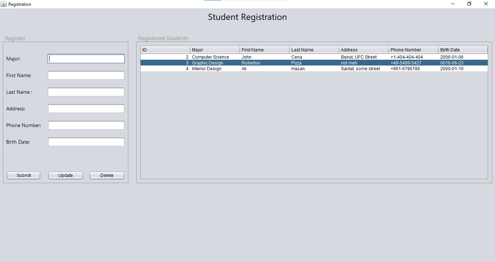

# University_System

### A University System including features implemented with front-end &amp; back-end technologies.

  

## Preview, Insert, Update or Delete Registered Students from System.

 

